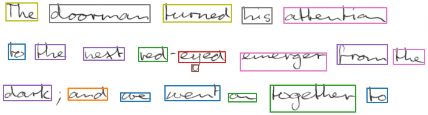
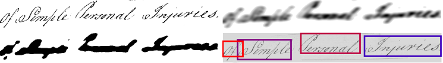
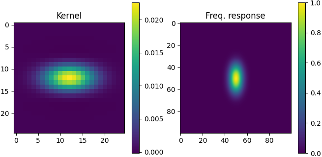

# Word segmentation

Implementation of the scale space technique for word segmentation proposed by 
[R. Manmatha and N. Srimal](http://ciir.cs.umass.edu/pubfiles/mm-27.pdf). 
Even though the paper is from 1999, the method still achieves good results, is fast, and is easy to implement. 
The algorithm takes an **image containing words as input** and **outputs the segmented words**.

## Run demo

* Install required packages by running `pip install -r requirements.txt`
* Go to the `src/` directory
* Run the script `python main.py` to detect words in line images (IAM dataset)
* Or, run `python main.py --data ../data/page --img_height 1000 --theta 5` to run the detector on an image of a page
* A window opens and shows the detections for the images contained in the  directory
* The script can be configured via command line, see available options by running `python main.py -h`

## Documentation

### Algorithm

The illustration below shows how the algorithm works:

* top left: input image
* top right: apply filter to the image
* bottom left: threshold filtered image
* bottom right: compute bounding boxes

The filter kernel with size=25, sigma=5 and theta=3 is shown below on the left. 
It models the typical shape of a word, with the width larger than the height (in this case by a factor of 3). 
On the right the frequency response is shown (DFT of size 100x100). 
The filter is in fact a low-pass, with different cut-off frequencies in x and y direction.

### Parameters

Most of the parameters of the function `detect_words` deal with the shape of the filter kernel:

* img: grayscale uint8 image containing the words to be segmented
* kernel_size: size of filter kernel, must be an odd integer
* sigma: standard deviation of Gaussian function used for filter kernel
* theta: approximated width/height ratio of words, filter function is distorted by this factor
* min_area: ignore word candidates smaller than specified area

The function `prepare_img` is used to convert the input image to grayscale and to resize it to a fixed height:

* img: input image
* height: image will be resized to fit specified height

### How to select parameters

* The algorithm is **not scale-invariant**
    * The default parameters give good results for a text height of 25-50 pixels
    * If working with lines, resize the image to 50 pixels height
    * If working with pages, resize the image so that the words have a height of 25-50 pixels
* The sigma parameter controls the width of the Gaussian function (standard deviation) along the x-direction. Small
  values might lead to multiply detection per word (over-segmentation), while large values might lead to a detection
  containing multiple words (under-segmentation)
* The kernel size depends on the sigma parameter and should be chosen large enough to contain as much of the non-zero
  kernel values as possible
* The average aspect ratio (width/height) of the words to be detected defines the theta parameter

The best way to find the optimal parameters is to use a dataset (e.g. IAM) and optimize the parameters w.r.t. some
evaluation metric (e.g. intersection over union).

## Results

This algorithm gives good results on datasets with large inter-word-distances and small intra-word-distances like IAM.
However, for historical datasets like Bentham or Ratsprotokolle results are not very good and more complex approaches
should be preferred (e.g., a neural network based approach as implemented in
the [WordDetectorNN repository](https://github.com/githubharald/WordDetectorNN)).
